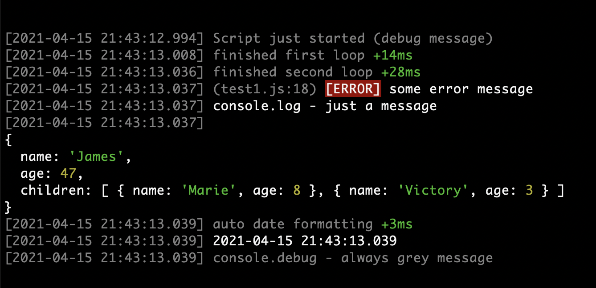

# useful
useful functions for every project

```console.debug()```

overwritten .debug, .log, .warn & .error functions
- added timestamp
- added highlighting
- object decoding
- date auto format
- added "+28ms" time in debug mode
- added line number for errors

```async_retry(n, wait, fn, ...args)```

function can make few retries. useful for any connections
